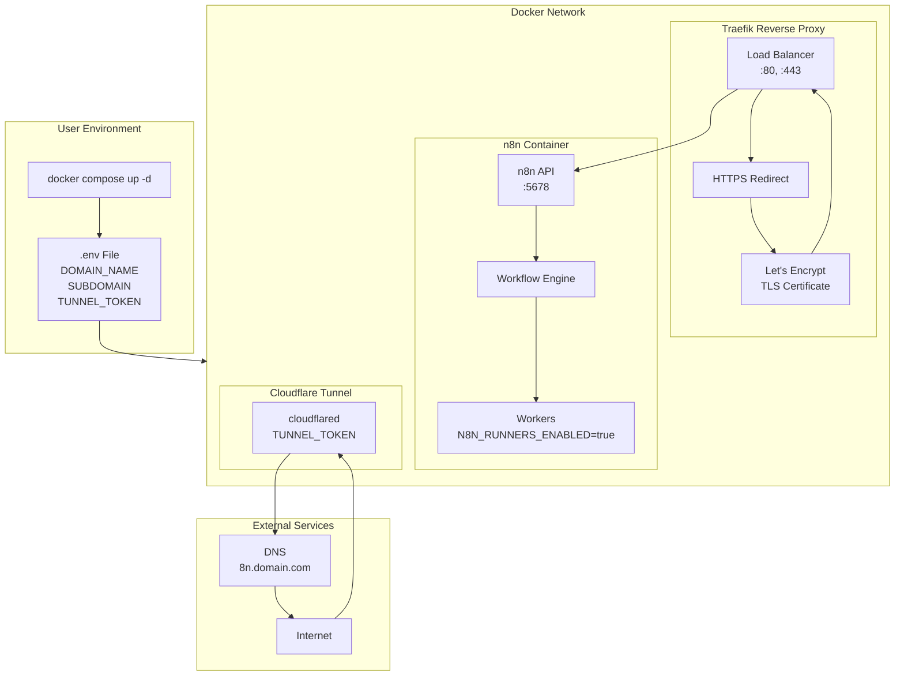

# Self-hosted n8n
This repository contains configuration files for running n8n (a workflow automation platform) as a self-hosted instance on your local machine or GitHub Codespace.

## Architecture Overview

## Key Features
* Docker Compose setups for various deployment scenarios (basic, with PostgreSQL, with worker mode)
* Kubernetes manifests for K8s deployments
* Caddy web server configuration for reverse proxy
* CloudFlare Tunnel integration to expose your local n8n instance to the internet

## Pre-requisites
The `.env` file that contains all these required credentials:
`DOMAIN_NAME`
`SUBDOMAIN`
`TUNNEL_TOKEN` (CloudFlare tunnel token)

### Estimated Monthly Cost
| Service Provider | Cost/mo | Note |
|------------------|---------|------|
| CloudFlare Domain Name| $1 |  |
| n8n Cloud ([free 14-day trial](https://n8n.io)) | $29 | *self-hosted VPS ~$10* |
| LINE Official Account for Messaging API| $40 |  |
| OpenAI LLM | $10 | *Credit top-up can be varied* |
| **Sum** | **$80** |

## How-to Run 
`docker compose up -d`

## Configure an Example Workflow
1. To be able to import the example workflow you need to create new workflow from `Start from scratch` first.
2. Create a credential for your provider of choice. Here the Ollama Cloud endpoint will be used.
3. Create Line API credentials.
4. Install Line Messaging node by community.
5. Copy the generated `webhook` from `Line Messaging API`.
6. Do not for get to `Publish` the workflow.

## Contribution
[Issues](https://github.com/piky/n8n-hosting/issues) or [suggestions](https://github.com/piky/n8n-hosting/discussions) for further improvement are welcome.